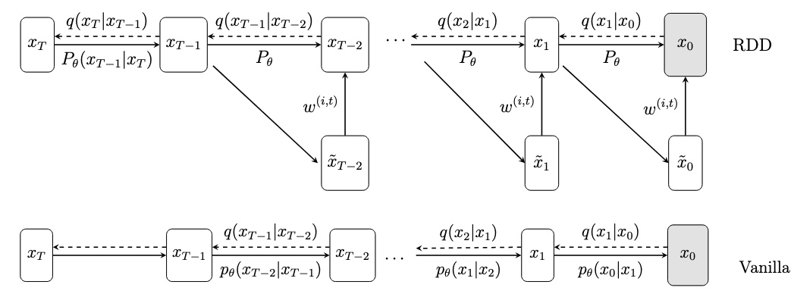

# RDD
# Reward-Directed Diffusion for Generative Design

This repository contains the code for the paper:

> **A Reward-Directed Diffusion Framework for Generative Design**
> Hadi Keramati, Patrick Kirchen, Mohammed Hannan, Rajeev K. Jaiman
> *Engineering Applications of Artificial Intelligence*, Volume 165, 2026
> [DOI: 10.1016/j.engappai.2025.113378](https://doi.org/10.1016/j.engappai.2025.113378)

## Overview

We present a generative optimization framework that fine-tunes a Denoising Diffusion Probabilistic Model (DDPM) using reward-directed sampling to generate high-performance engineering designs. The key idea is to reformulate the reverse diffusion process as an entropy-regularized Markov Decision Process and iteratively apply a **soft value function** to guide generation toward high-reward regions without requiring gradients of the reward function.

<p align="center">
  
</p>

### Key Features

- **Gradient-free optimization**: Works with non-differentiable reward models (e.g., XGBoost, ensemble methods, graph neural networks) and costly physics simulations.
- **Iterative reward guidance**: Combines reward-weighted MLE fine-tuning (training phase) with soft value-based importance sampling (inference phase), distributing computational cost across both phases.
- **Beyond-distribution generation**: Produces designs that exceed the performance of the training data, over **10% improvement in lift-to-drag ratio** for airfoil design and more than **25% reduction in resistance** for ship hull design.
- **Parametric design representation**: Operates on vectorized design parameters, making it compatible with standard engineering parameterizations.

## Released Code: Aerodynamic (Airfoil) Design

> **Note:** The marine (ship hull) design component was developed in collaboration with our industry sponsors whith whom we have ongoing work, and is **not included** in this public release. Only the **2D airfoil aerodynamic design** pipeline is provided.

The released notebook (`EAAI.ipynb`) contains the full pipeline for the airfoil case:

| Stage | Description |
|---|---|
| **1. Surrogate model** | Trains an XGBoost regression model to predict C_l/C_d from airfoil coordinates, used as the reward function. |
| **2. DDPM pre-training** | Trains a 1D attention-based U-Net diffusion model on 38,000 airfoil designs (192 points × 2 coordinates). |
| **3. Reward-weighted MLE fine-tuning** | Fine-tunes the pre-trained DDPM using reward-weighted loss (Algorithm 1 in the paper) to shift the learned distribution toward higher C_l/C_d. |
| **4. Reward-based importance sampling (SVDD)** | Samples from the fine-tuned model using soft value-based decoding (Algorithm 2) to generate optimized airfoil designs. |

## Getting Started

### Requirements

```
python >= 3.9
torch >= 2.0
numpy
scikit-learn
xgboost
matplotlib
pandas
```

### Usage

1. **Prepare data**: Place your airfoil dataset (38,000 designs, each with 384 coordinate values and C_l/C_d label) in the working directory. We use an augmented version of the [UIUC airfoil dataset](https://m-selig.ae.illinois.edu/ads/coord_database.html) following [Heyrani Nobari et al. (2021)](https://dl.acm.org/doi/10.1145/3447548.3467414).

2. **Run the notebook**: Open `EAAI.ipynb` in Jupyter or Google Colab and execute the cells sequentially:
   - **Cell 0**: Train the surrogate reward model (XGBoost).
   - **Cell 1–3**: Pre-train the DDPM and generate baseline samples.
   - **Cell 13–16**: Fine-tune using reward-weighted MLE.
   - **Cell 17–18**: Generate optimized airfoils via SVDD sampling.

3. **Evaluate**: Generated airfoil coordinates can be validated with [XFOIL](https://web.mit.edu/drela/Public/web/xfoil/).

### Key Hyperparameters

| Parameter | Pre-training | Fine-tuning | Sampling |
|---|---|---|---|
| Diffusion steps (T) | 1000 | inherited | inherited |
| Batch size | 64 | 8 trajectories | — |
| Learning rate | 1×10⁻⁴ | 1×10⁻⁴ | — |
| Reward temperature (α) | — | 0.4 | 8 |
| Proposals per step (M) | — | — | 3–10 |
| Number of samples (N) | — | — | 1000 |

## Method Summary

The framework proceeds in four steps:

1. **Parameterize** the design geometry as a vector of features.
2. **Pre-train** a DDPM to learn the data distribution over designs.
3. **Fine-tune** via reward-weighted MLE: samples are weighted by `exp(r(x₀)/α)` so high-reward designs contribute more to the loss (Eq. 34 in the paper).
4. **Sample** from the fine-tuned model using soft value-based importance sampling: at each reverse step, M candidates are drawn and one is selected proportionally to its estimated reward (Algorithm 2).

The soft value function at each intermediate timestep is approximated via the posterior mean estimator:

$$\hat{x}_0 = \frac{x_t - \sqrt{1 - \bar{\alpha}_t}\,\epsilon_\theta(x_t, t)}{\sqrt{\bar{\alpha}_t}}$$

This enables reward evaluation without backpropagation through the reward model.

## Results

| Method | Airfoil (C_l/C_d) | Ship Hull (R, Newtons) |
|---|---|---|
| Genetic Algorithm | 212.51 | 2.49 × 10⁶ |
| CMA-ES | 212.26 | 2.47 × 10⁶ |
| Bayesian Optimization | 204.83 | 2.51 × 10⁶ |
| **RDD (ours)** | **238.43** | **2.31 × 10⁶** |

## Citation

```bibtex
@article{keramati2026reward,
  title={A reward-directed diffusion framework for generative design},
  author={Keramati, Hadi and Kirchen, Patrick and Hannan, Mohammed and Jaiman, Rajeev K.},
  journal={Engineering Applications of Artificial Intelligence},
  volume={165},
  pages={113378},
  year={2026},
  publisher={Elsevier},
  doi={10.1016/j.engappai.2025.113378}
}
```

## License

This project is released for academic and research purposes. Please cite the paper if you use this code.

## Acknowledgments

This work is supported by NSERC Alliance Grant with Elomatic and InnovMarine, and computational resources provided by Advanced Research Computing (ARC) at the University of British Columbia and Compute Canada. The marine/ship hull design component remains proprietary to our industry sponsors.

## Contact

Hadi Keramati, [hadi.keramati@ubc.ca](mailto:hadi.keramati@ubc.ca)
Department of Mechanical Engineering, University of British Columbia, Vancouver, BC, Canada
